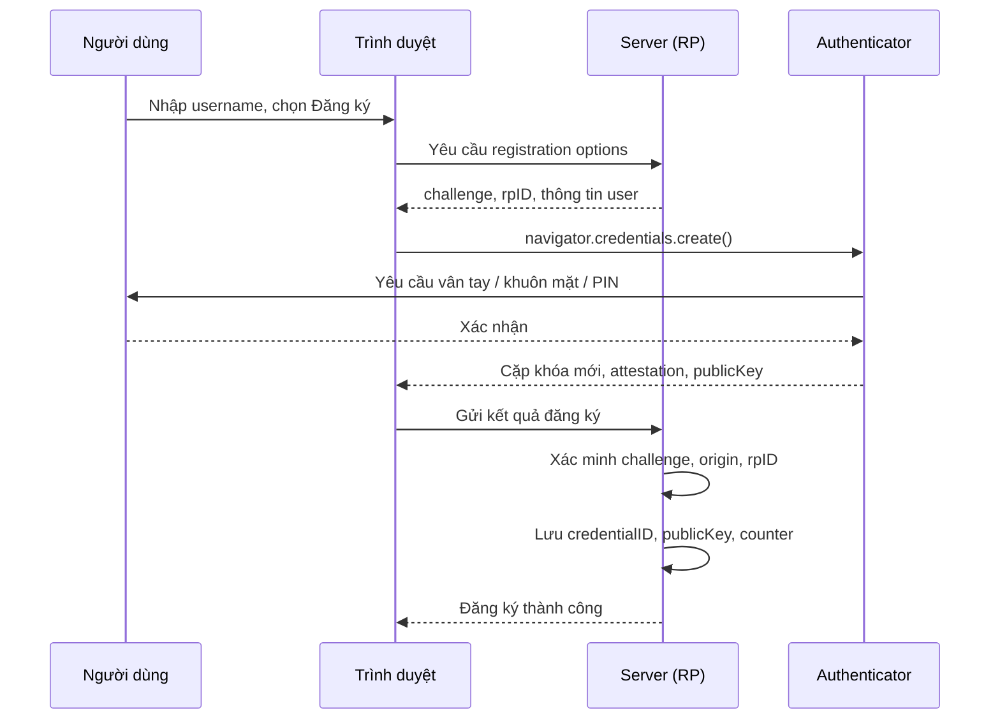
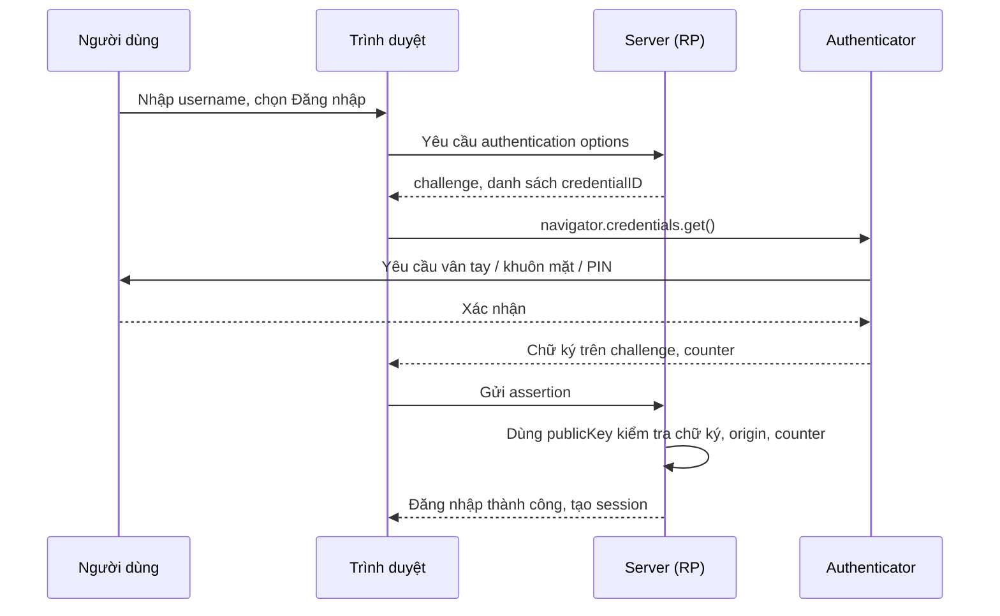

# Demo Xác Thực Không Mật Khẩu FIDO2 / WebAuthn (Passkeys)

Đồ án môn **Bảo Mật Thông Tin**, Viet-Japan Institute of Technology (HUTECH).

Dự án hiện thực một ứng dụng web cho phép người dùng đăng ký và đăng nhập bằng Passkey (Touch ID, Face ID, Windows Hello, YubiKey) thay cho mật khẩu. Server chỉ lưu khóa công khai, nên rò rỉ cơ sở dữ liệu không làm lộ thông tin đăng nhập, và trình duyệt gắn tên miền thật vào mỗi chữ ký nên trang giả mạo không thể lấy được phiên xác thực.

---

## Mục lục

1. [Mục tiêu](#1-mục-tiêu)
2. [Cơ chế bảo mật](#2-cơ-chế-bảo-mật)
3. [Kiến trúc và luồng xác thực](#3-kiến-trúc-và-luồng-xác-thực)
4. [Công nghệ sử dụng](#4-công-nghệ-sử-dụng)
5. [Cấu trúc thư mục](#5-cấu-trúc-thư-mục)
6. [Cài đặt và chạy](#6-cài-đặt-và-chạy)
7. [Kịch bản demo](#7-kịch-bản-demo)
8. [Phân công thành viên](#8-phân-công-thành-viên)
9. [Quy trình làm việc với Git](#9-quy-trình-làm-việc-với-git)
10. [Giới hạn của bản demo](#10-giới-hạn-của-bản-demo)
11. [Tài liệu tham khảo](#11-tài-liệu-tham-khảo)

---

## 1. Mục tiêu

- Tìm hiểu chuẩn FIDO2, gồm giao thức WebAuthn (W3C) và CTAP2 (FIDO Alliance).
- Xây dựng demo hoàn chỉnh hai luồng: đăng ký Passkey và đăng nhập bằng Passkey.
- Chứng minh bằng thực nghiệm ba tính chất: chống phishing, chống tấn công phát lại, và không lưu bí mật trên server.

## 2. Cơ chế bảo mật

| Mối đe dọa | Cách FIDO2 xử lý | Vị trí trong mã nguồn |
| :--- | :--- | :--- |
| Phishing, giả mạo trang web | Trình duyệt ghi `origin` thật vào `clientDataJSON`. Authenticator chỉ ký cho đúng `rpID`. Server so khớp `expectedOrigin` và `expectedRPID`. | `routes/auth.js` |
| Tấn công phát lại (replay) | Mỗi phiên dùng một `challenge` ngẫu nhiên, dùng một lần. Gói tin ghi lại không còn hợp lệ ở lần gửi thứ hai. | `routes/auth.js` |
| Nhân bản thiết bị xác thực | Bộ đếm `counter` tăng sau mỗi lần ký. Server từ chối khi giá trị nhận được nhỏ hơn hoặc bằng giá trị đã lưu. | `routes/auth.js`, `db.js` |
| Rò rỉ cơ sở dữ liệu | Server chỉ lưu `credentialID`, `publicKey` và `counter`. Không có mật khẩu hay khóa bí mật. | `db.js` |
| Đánh cắp khóa bí mật | Khóa bí mật được sinh và giữ trong phần cứng (Secure Enclave, TPM, YubiKey) và không bao giờ gửi qua mạng. | Authenticator |

## 3. Kiến trúc và luồng xác thực

Hệ thống có ba thành phần:

- **Authenticator:** thiết bị giữ khóa bí mật và ký challenge (Touch ID, Windows Hello, YubiKey).
- **Client:** trình duyệt chạy `@simplewebauthn/browser` và gọi WebAuthn API.
- **Relying Party (RP):** server Node.js sinh challenge và xác minh chữ ký.

### Luồng đăng ký



### Luồng đăng nhập



## 4. Công nghệ sử dụng

| Lớp | Công nghệ | Phiên bản |
| :--- | :--- | :--- |
| Runtime | Node.js (ES Modules) | 18 trở lên |
| Web server | Express | 5.2.1 |
| Phiên làm việc | express-session | 1.19.0 |
| FIDO2 phía server | `@simplewebauthn/server` | 14.0.3 |
| FIDO2 phía client | `@simplewebauthn/browser` | 14.0.0 |
| Giao diện | HTML5, CSS3, JavaScript thuần | - |

## 5. Cấu trúc thư mục

```text
fido2/
├── server.js              # Khởi tạo Express, session, phục vụ thư mục public
├── db.js                  # Lưu trữ user và credential
├── routes/
│   └── auth.js            # API đăng ký và đăng nhập FIDO2
├── public/
│   ├── index.html         # Cấu trúc trang
│   ├── css/
│   │   └── style.css      # Giao diện
│   └── js/
│       ├── webauthn.js    # Gọi WebAuthn API và các endpoint backend
│       └── ui.js          # Xử lý sự kiện, loading, thông báo
├── LEADER_GUIDE.md        # Sổ tay nhóm: quy trình Git và lộ trình sprint
├── package.json
└── README.md
```

Mỗi thành viên sửa file riêng, nhờ đó khi gộp Pull Request không phát sinh conflict.

### API backend

| Phương thức | Endpoint | Chức năng |
| :--- | :--- | :--- |
| GET | `/api/auth/register-options` | Sinh challenge và tùy chọn đăng ký |
| POST | `/api/auth/register-verify` | Xác minh phản hồi đăng ký, lưu credential |
| GET | `/api/auth/login-options` | Sinh challenge và tùy chọn đăng nhập |
| POST | `/api/auth/login-verify` | Xác minh chữ ký, cập nhật counter, tạo session |

## 6. Cài đặt và chạy

**Yêu cầu**

- Node.js 18 trở lên và Git.
- Trình duyệt hỗ trợ WebAuthn (Chrome, Edge, Safari, Firefox).
- Thiết bị có cảm biến sinh trắc học, Windows Hello, hoặc khóa bảo mật FIDO2.

**Các bước**

```bash
git clone https://github.com/nguyenquockiet2462005/fido2.git
cd fido2
npm install
npm start
```

Mở trình duyệt tại `http://localhost:3000` (hoặc cổng server in ra ở terminal).

WebAuthn chỉ hoạt động trên `localhost` hoặc HTTPS. Truy cập bằng địa chỉ IP qua HTTP sẽ bị trình duyệt chặn.

## 7. Kịch bản demo

**Kịch bản 1: Luồng chuẩn**
Nhập username, bấm Đăng ký, xác nhận bằng vân tay hoặc PIN, sau đó đăng nhập bằng Passkey vừa tạo.

**Kịch bản 2: Kiểm tra dữ liệu server**
Mở `db.js` hoặc in nội dung lưu trữ ra console. Dữ liệu chỉ gồm `credentialID`, `publicKey` và `counter`, không có mật khẩu hay hash.

**Kịch bản 3: Tấn công phát lại**
Dùng DevTools (tab Network) sao chép request `login-verify` đã thành công, rồi gửi lại. Server từ chối vì challenge đã được dùng.

**Kịch bản 4: Sai nguồn gốc (origin)**
Chạy bản sao của ứng dụng trên một origin khác với `expectedOrigin` và thử đăng nhập. Phần xác minh origin thất bại, minh họa cơ chế chống phishing.

## 8. Phân công thành viên

| Họ và tên | MSSV | Vai trò | File phụ trách |
| :--- | :--- | :--- | :--- |
| Quốc Kiệt | (điền MSSV) | Nhóm trưởng, Tech Lead | `server.js`, `db.js`, review Pull Request, báo cáo |
| Khoa | (điền MSSV) | Backend FIDO2 | `routes/auth.js` |
| Huy | (điền MSSV) | Frontend FIDO2 | `public/js/webauthn.js` |
| Đạt | (điền MSSV) | Frontend UI | `public/index.html`, `public/css/style.css`, `public/js/ui.js` |

`ui.js` gọi hai hàm do `webauthn.js` cung cấp: `registerPasskey(username)` và `loginPasskey(username)`. Hai file này tách biệt nên hai thành viên làm song song được.

## 9. Quy trình làm việc với Git

Nhánh `main` là bản ổn định dùng để chấm điểm và báo cáo. Không ai push trực tiếp lên `main`.

```bash
# 1. Cập nhật main
git checkout main
git pull origin main

# 2. Tạo nhánh riêng (chỉ lần đầu)
git checkout -b feature/<ten-chuc-nang>

# 3. Commit
git add .
git commit -m "feat: mo ta ngan gon"

# 4. Đẩy nhánh
git push origin feature/<ten-chuc-nang>
```

Sau đó mở Pull Request trên GitHub vào `main`. Nhóm trưởng review, hỏi lại người viết về đoạn code chính, rồi mới Merge.

**Quy ước**

- Không commit `node_modules/`, `.env`, private key hoặc token. Các mục này nằm trong `.gitignore`.
- Commit message theo dạng `feat:`, `fix:`, `docs:`, `refactor:`.
- Khi `git pull` báo lỗi vì có thay đổi chưa commit, hãy commit hoặc dùng `git stash` trước.

## 10. Giới hạn của bản demo

- Dữ liệu user và credential nên được đặt trong cơ sở dữ liệu thật (SQLite, PostgreSQL, MongoDB) khi triển khai. Lưu trong bộ nhớ sẽ mất khi server khởi động lại.
- Session dùng `express-session` với store mặc định, chưa phù hợp cho môi trường production.
- Chưa có cơ chế khôi phục tài khoản khi mất thiết bị. Hướng mở rộng gồm đăng ký nhiều Passkey cho một tài khoản, hoặc mã dự phòng.
- Chưa cấu hình HTTPS và `rpID` cho tên miền thật.

## 11. Tài liệu tham khảo

- W3C, [Web Authentication: An API for accessing Public Key Credentials, Level 2](https://www.w3.org/TR/webauthn-2/)
- FIDO Alliance, [FIDO2 specifications](https://fidoalliance.org/specifications/)
- [SimpleWebAuthn documentation](https://simplewebauthn.dev/docs/)
- MDN, [Web Authentication API](https://developer.mozilla.org/docs/Web/API/Web_Authentication_API)